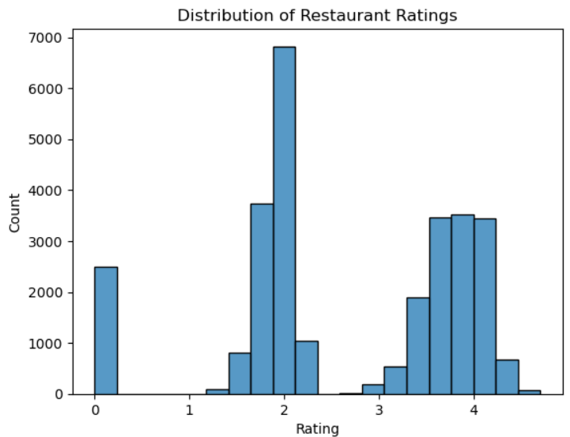
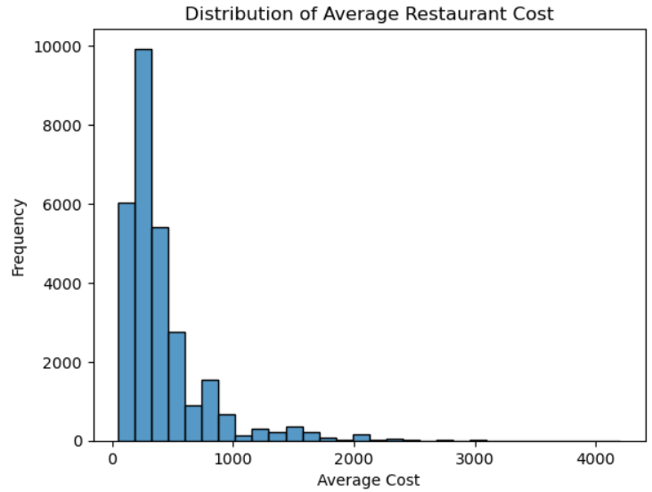
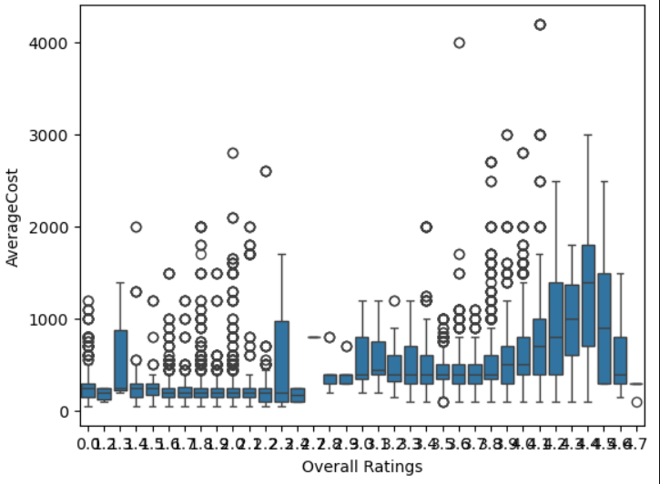
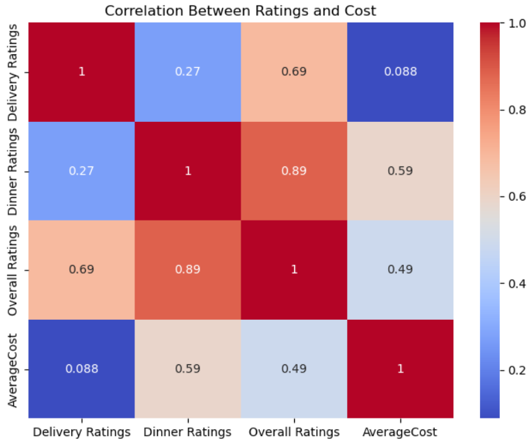
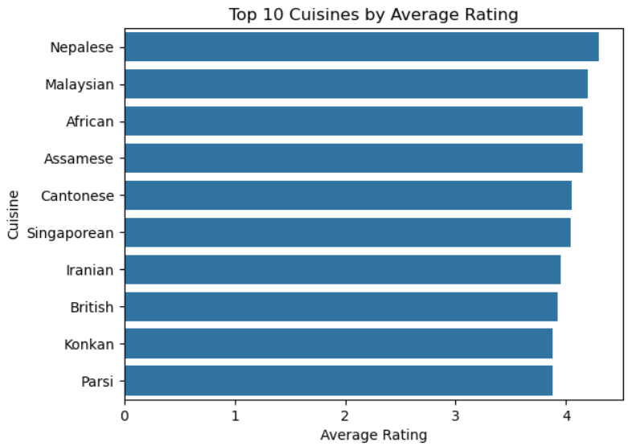
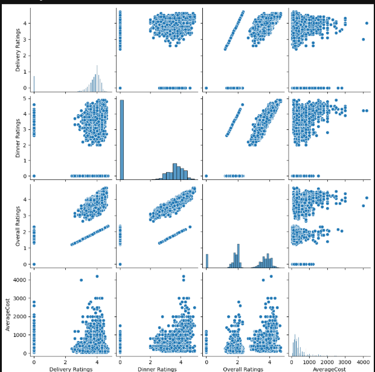

<h1 align="center">🍽️ Zomato Restaurant Data Analysis</h1>

Exploratory Data Analysis (EDA) using Python, Pandas, and Seaborn

<h2>📌 Project Overview</h2>

This project performs <b>Exploratory Data Analysis (EDA)</b> on a restaurant dataset to understand patterns related to 
<b>restaurant ratings, cuisines, pricing, and city distribution</b>.

Using <b>Python, Pandas, Matplotlib, and Seaborn</b>, the dataset was cleaned, analyzed, and visualized to uncover insights 
about restaurant performance and customer preferences.

<h2>🎯 Objectives</h2>

<ul>
<li>Analyze the distribution of restaurant ratings</li>
<li>Study the distribution of restaurant prices</li>
<li>Understand the relationship between ratings and cost</li>
<li>Identify top cuisines based on ratings</li>
<li>Analyze restaurant distribution across cities</li>
</ul>

<h2>🛠 Tools & Technologies</h2>

<ul>
<li>Python</li>
<li>Pandas</li>
<li>NumPy</li>
<li>Matplotlib</li>
<li>Seaborn</li>
<li>Jupyter Notebook</li>
</ul>

<h2>📂 Dataset Information</h2>

The dataset contains restaurant information including:

<ul>
<li>Restaurant Name</li>
<li>City</li>
<li>Cuisines</li>
<li>Delivery Ratings</li>
<li>Dinner Ratings</li>
<li>Average Cost</li>
<li>Overall Ratings</li>
</ul>

<h2>🧹 Data Cleaning & Feature Engineering</h2>

Before performing analysis, the dataset was cleaned and prepared.

<ul>
<li>Handled missing values represented by "-"</li>
<li>Converted rating columns to numeric values</li>
<li>Created a new feature called <b>Overall Ratings</b></li>
</ul>

<pre>
df['Delivery Ratings'] = df['Delivery Ratings'].replace('-',0).astype(float)
df['Dinner Ratings'] = df['Dinner Ratings'].replace('-',0).astype(float)

df['Overall Ratings'] = (df['Delivery Ratings'] + df['Dinner Ratings']) / 2
</pre>

<h2>📊 Exploratory Data Analysis</h2>

<h3>⭐ Rating Distribution</h3>

Most restaurants have ratings between <b>3 and 4.5</b>, indicating that the majority of restaurants receive positive customer feedback.

<h3>💰 Cost Distribution</h3>

Most restaurants fall within the <b>low to medium price range</b>, while only a few restaurants have very high prices.

<h3>📈 Rating vs Cost Relationship</h3>

The scatter plot suggests a <b>positive relationship between ratings and cost</b>, meaning higher rated restaurants often have higher prices.

<h3>📦 Cost Distribution Across Ratings</h3>

Higher rated restaurants generally show higher median costs, although some lower-cost restaurants still achieve high ratings.

<h3>🍜 Top Cuisines by Rating</h3>

Some cuisines consistently receive higher ratings, indicating strong customer satisfaction.

<h3>🌍 City Distribution of Restaurants</h3>

This visualization shows which cities have the highest concentration of restaurants in the dataset.

<h3>🔗 Pairwise Relationship Between Ratings and Cost</h3>

This pairplot visualizes the relationships between <b>Delivery Ratings</b>, 
<b>Dinner Ratings</b>, <b>Overall Ratings</b>, and <b>Average Cost</b>. 
The scatter plots show how these variables interact with each other, while 
the diagonal histograms display the distribution of each variable.

From the visualization, we can observe that <b>Dinner Ratings and Overall Ratings show a strong positive relationship</b>, 
while <b>Average Cost tends to increase with higher ratings in some cases</b>. 
This plot helps identify correlations, patterns, and potential outliers in the dataset.

<h2>📈 Key Insights</h2>

<ul>
<li>Most restaurants are rated between <b>3 and 4.5</b></li>
<li>Higher rated restaurants tend to have higher average costs</li>
<li>Affordable restaurants can still receive high ratings</li>
<li>Certain cuisines consistently receive better ratings</li>
<li>Restaurant distribution varies across cities</li>
</ul>

<h2>🚀 Future Improvements</h2>

<ul>
<li>City-wise restaurant analysis</li>
<li>Interactive dashboard using <b>Power BI or Tableau</b></li>
<li>Predict restaurant ratings using machine learning</li>
</ul>

<h2>📁 Project Structure</h2>

<pre>
zomato-data-analysis
│
├── ZOMATOPROO.ipynb
├── dataset.csv
│
├── images
│   ├── rating_distribution.png
│   ├── cost_distribution.png
│   ├── rating_vs_cost.png
│   ├── cost_vs_rating.png
│   ├── top_cuisines.png
│   └── city_distribution.png
│
└── README.md
</pre>

<h2>👩‍💻 Author</h2>

<b>Supriya Bajpai</b> 
Aspiring Data Analyst

Skills:

<ul>
<li>Python</li>
<li>SQL</li>
<li>Power BI</li>
<li>Data Visualization</li>
</ul>

⭐ If you like this project, consider giving the repository a star!

